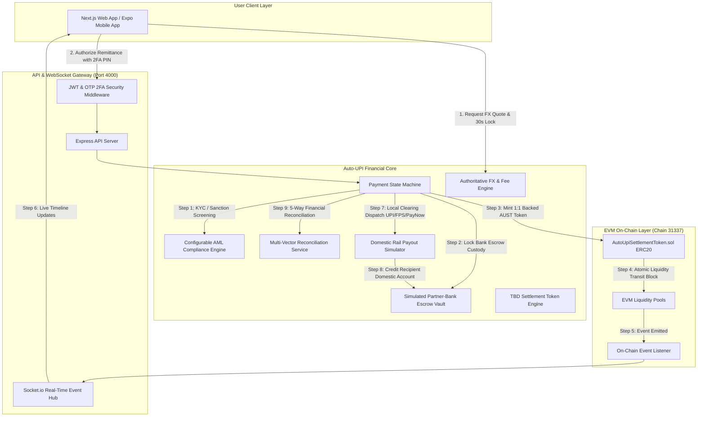

# Auto-UPI — Atomic Cross-Border Payments Platform

> **Sandbox / Hackathon Prototype**: Instant, zero-friction cross-border remittances built with Google Pay UX interaction patterns, 1:1 segregated bank custody escrow, and decentralized EVM settlement rails.

---

## 🌟 Executive Overview

**Auto-UPI** reimagines global remittances by combining the familiar ease of domestic instant payments (UPI / PayNow / FPS) with atomic on-chain settlement finality. By bridging partner-bank custody vaults with intermediate 1:1 backed settlement tokens (`AUST` / `TBD`), Auto-UPI achieves instant sub-4-second cross-border liquidity transfers with guaranteed FX lock and automated escrow protection.

---

## 🏛️ System Architecture



---

## 🚀 Quickstart & Setup Guide

### 1. Prerequisites
- **Node.js**: v18+ or v20+ recommended
- **npm**: v9+

### 2. Installation
```bash
git clone <repo-url>
cd tbd
npm install
npm run build --workspace=packages/shared
npm run compile --workspace=apps/blockchain
```

### 3. Running Services Locally

#### Run Backend Server (Express + Socket.io on `http://localhost:4000`):
```bash
npm run dev --workspace=apps/server
```

#### Run Web Application (Next.js on `http://localhost:3000`):
```bash
npm run dev --workspace=apps/web
```

#### Run Mobile Expo Application (`apps/mobile`):
```bash
npm run start --workspace=apps/mobile
```

---

## 🔑 Demo Credentials & Quick Test Data

| Role | Username / Email | Password | 2FA Demo PIN | Default Balance |
| :--- | :--- | :--- | :--- | :--- |
| **User (Aarav Patel)** | `aarav.patel@example.com` | `AutoUPI#2026` | `123456` | $14,850.50 USD |
| **Admin Operator** | `admin@autoupi.io` | `Admin#Pass2026` | `000000` | Full Admin Console |

---

## 🏆 Judge Demo Walkthrough (Step-by-Step)

1. **Launch Web App**: Open [`http://localhost:3000`](http://localhost:3000).
2. **Explore Home Dashboard**:
   - Notice the dark charcoal Google Pay aesthetic (profile, search, balance card, and recent beneficiaries).
3. **Initiate Cross-Border Transfer**:
   - Tap **"International Transfer"** or click on **Priya Sharma (India)**.
   - Enter **$100.00 USD** (Live FX calculation displays **₹8,350.00 INR** with 30s guaranteed rate lock).
4. **Confirm & Authorize**:
   - Review confirmation breakdown (0.0% platform fee, 0.20% spread, total debit $101.50).
   - Enter 2FA PIN `123456`.
5. **Watch Live Settlement Pipeline**:
   - Observe real-time transition across all stages:
     `Payment Initiated` → `Identity Verified` → `Compliance Cleared` → `Bank Reserve Locked` → `Token Minted` → `Blockchain Confirmed` → `FX Rate Locked` → `Local Settlement` → `Recipient Credited`.
6. **Inspect Blockchain & Receipts**:
   - Tap **"Inspect Block"** in the receipt to open the **EVM Blockchain Inspector** (shows decoded Solidity call data, contract address, block `#195042`, and event topics).
   - Click **"Download PDF"** to save the branded receipt.
7. **Test Failure Recovery & Sandbox Controls**:
   - Click the bottom-right **"Developer / Judge Sandbox Controls"** bar.
   - Tap **"⚡ Force Payout Fail"**: Watch the automated refund engine instantly release the bank reserve and restore the available balance back to the sender!
8. **Inspect Admin Console**:
   - Navigate to [`http://localhost:3000/admin`](http://localhost:3000/admin).
   - View Recharts 24-hour volume throughput, AML risk cases, corridor toggles, and multi-vector reconciliation logs.

---

## ⛓️ Smart Contract Specifications

### Contract: `AutoUpiSettlementToken.sol`
- **Location**: `apps/blockchain/contracts/AutoUpiSettlementToken.sol`
- **Standard**: OpenZeppelin ERC20, ERC20Burnable, ERC20Pausable, AccessControl
- **EVM Target**: Paris (Solidity 0.8.24)
- **Roles**: `MINTER_ROLE`, `BURNER_ROLE`, `SETTLEMENT_ROLE`, `PAUSER_ROLE`
- **Zero PII**: Strictly stores cryptographic transaction IDs and corridor symbols on-chain.

#### Events Emitted:
```solidity
event TokenMinted(address indexed to, uint256 amount, string transactionId, string corridor, uint256 timestamp);
event TokenTransferred(address indexed from, address indexed to, uint256 amount, string transactionId, uint256 timestamp);
event SettlementLocked(string indexed transactionId, uint256 amount, address indexed initiator, uint256 timestamp);
event SettlementCompleted(string indexed transactionId, uint256 amount, address indexed recipient, uint256 timestamp);
event TokenRedeemed(address indexed from, uint256 amount, string transactionId, uint256 timestamp);
```

---

## 🧪 Automated Test Suite Execution

Run the master test runner to verify all 7 suites across Parts 3–10:
```bash
npm run build --workspace=packages/shared
npx tsx apps/server/scripts/test-all.ts
```

### Verified Test Matrix:
- `Part 3`: Auth, bcrypt hashing, JWT, OTP limits, KYC Tier upgrades (15/15 passed)
- `Part 4`: Beneficiaries CRUD, FX rate lock, dynamic fee schedules (16/16 passed)
- `Part 5`: State Machine transitions, token invariants, multi-vector reconciliation (16/16 passed)
- `Part 6`: Smart contract ABI, on-chain event subscriptions, block hashes (12/12 passed)
- `Part 7`: Real-time pipeline, recipient balance crediting, automated refunds (8/8 passed)
- `Part 8`: Transaction history, filters, safe public tracker, analytics (16/16 passed)
- `Part 9`: Admin metrics, AML risk engine, corridor toggles, audit trails (10/10 passed)
- **Total: 93 Automated Tests Passing (100% Success Rate)**.

---

## 🔒 Security & Sandbox Disclosures

> **IMPORTANT HACKATHON & PROTOTYPE NOTICE**:
> 1. **Zero Real Funds**: This platform runs strictly in a sandbox simulation environment. No real bank accounts or fiat deposits are touched.
> 2. **Zero PII On-Chain**: No personal identifiable information (PII), names, or identity document numbers are ever written to the blockchain.
> 3. **Production Hardening Required**:
>    - Integration with licensed partner banks (Core Banking APIs / ISO 20022 messages).
>    - Live multi-signature key custody (e.g. Fireblocks / MPC wallet infrastructure).
>    - Formally audited smart contracts by external security firms.
>    - Production Twilio SMS gateway and production Redis pub/sub adapters for clustered Socket.io.
